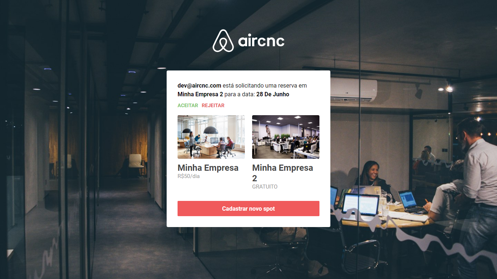
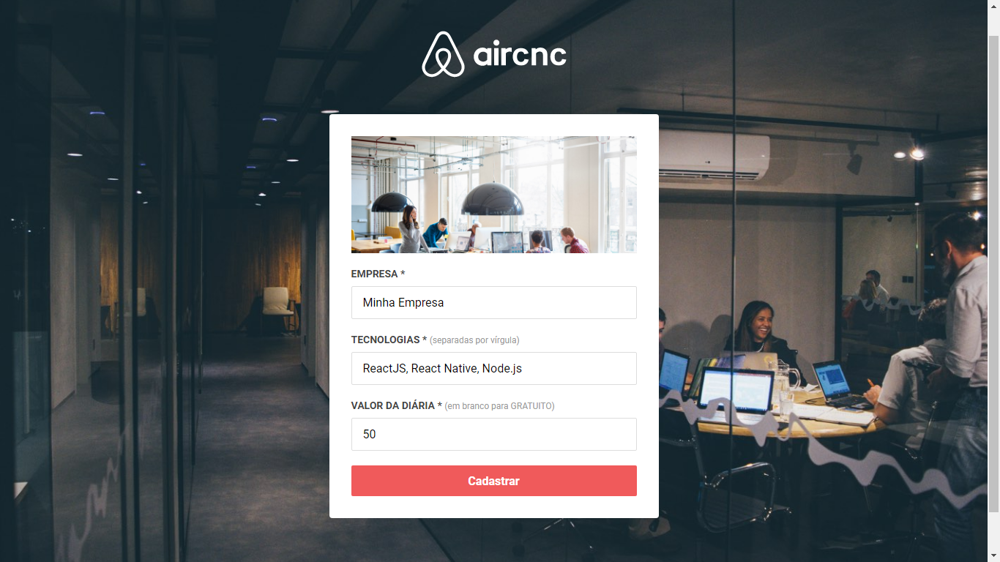
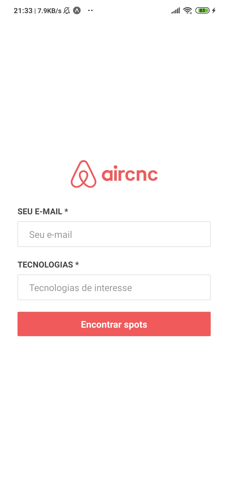
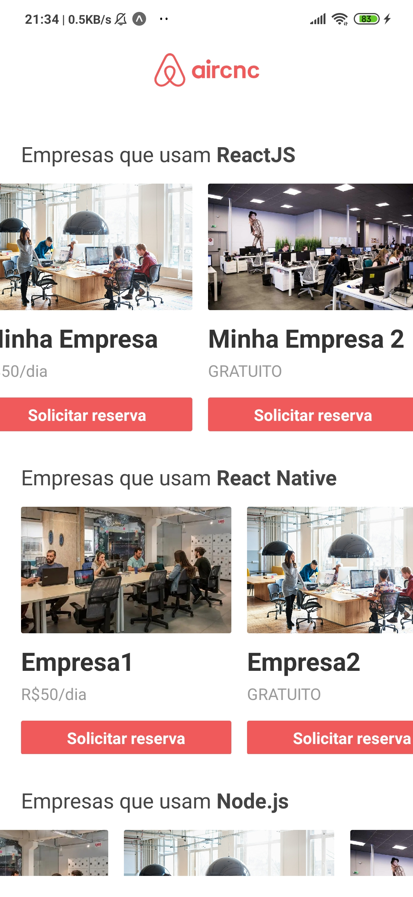

<h1 align="center">
 
  
 
 
AirCnC
</h1>

"Ofereça spots para programadores e encotre talentos para a sua empresa"

  

# :camera: Screenshots

### :computer: Web

   
  

### :iphone: Mobile

   
   
  

## :suspect: Tecnologias

- ⚛️ **React Js**
- ⚛️ **React Native**
- 💹 **Node Js**
- 📄 **MongoDB** 
- ♻️ **Socket IO**

## :godmode: Instalação

1. Clone esse repositório com o comando `git clone https://github.com/israelfagundes/aircnc.git` 

### :suspect: Back-end (API)

1. Na pasta principal do projeto, rode o comando `cd backend`
2. Instale as dependências utilizando o `yarn` ou o seu gerenciador de pacotes preferido.
3. Renomeie o arquivo `.env.example` para `.env` e preencha a variável `BASE_URL` com o IP local do seu computador, e preencha a variável `MONGO_DB` com a sua url de conexão com o servidor Mongo.
4. Rode o comando `yarn dev` para iniciar o servidor.

### :suspect: Front-End App

1. Na pasta principal do projeto, rode o comando `cd frontend`
2. Instale as dependências utilizando o `yarn` ou o seu gerenciador de pacotes preferido.
3. Rode o comando `yarn start`

### :suspect: Mobile

1. Na pasta principal do projeto, rode o comando `cd mobile`
2. Instale as dependências utilizando o `yarn` ou o seu gerenciador de pacotes preferido.
3. Rode o comando `yarn start` para iniciar o Expo
4. No seu smartphone, instale o aplicativo `Expo`, e escaneie o QR Code para iniciar o aplicativo.

## :memo: Licença

Esse projeto está sob a licença MIT. Veja o arquivo [LICENSE](LICENSE.md) para mais detalhes.
